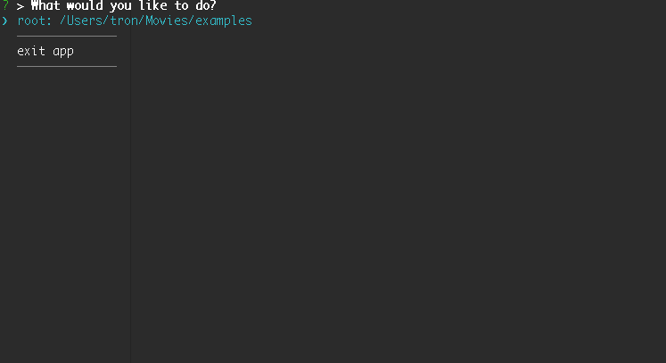

 omxfinder - CLI Frontend [omxplayer](http://omxplayer.sconde.net/)
===========



[](https://nodei.co/npm/omxfinder/)

## Requirement

install [omxplayer](http://omxplayer.sconde.net/)

```
$ sudo apt-get install omxplayer
```

or

Build and install [popcornmix/omxplayer](https://github.com/popcornmix/omxplayer) (* recommended)

```
$ git clone https://github.com/popcornmix/omxplayer.git
$ ./prepare-native-raspbian.sh
$ make ffmpeg
$ make
$ sudo make install
```

## Install

To install omxfinder run the following

```
$ npm install -g omxfinder
```

## Configuration

set first opened directory  
config file created current directory: `.omxfinder`

```
$ cat .omxfinder
$ {"dir":["<first-opened-directory-path>"]}
```

#### ex)

```
$ cat .omxfinder
$ {"dir":["/mnt/share/movies"]}
```

## Start app

```
$ omxfinder
```
